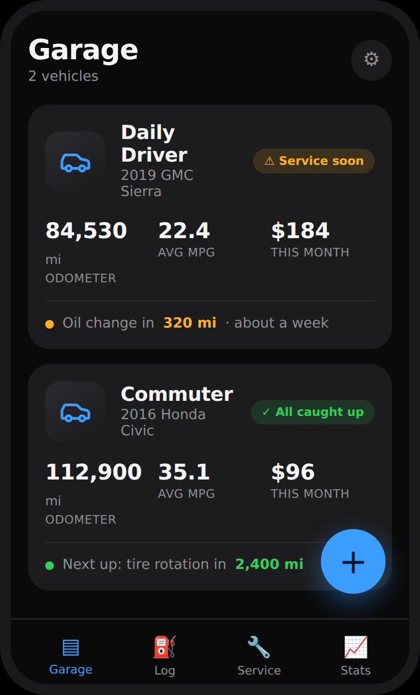
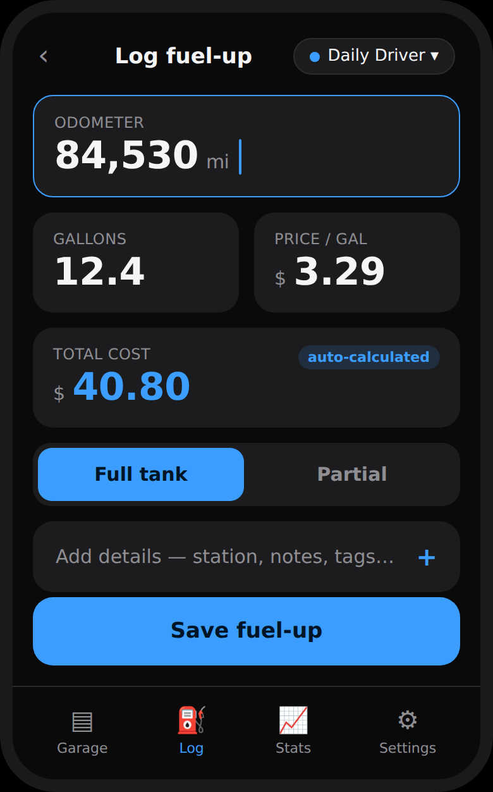
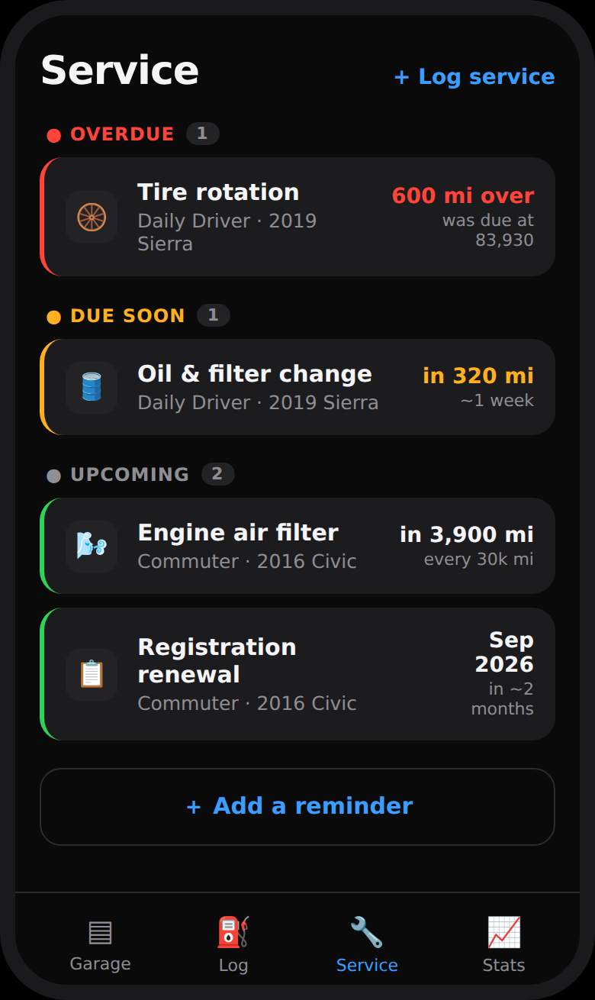
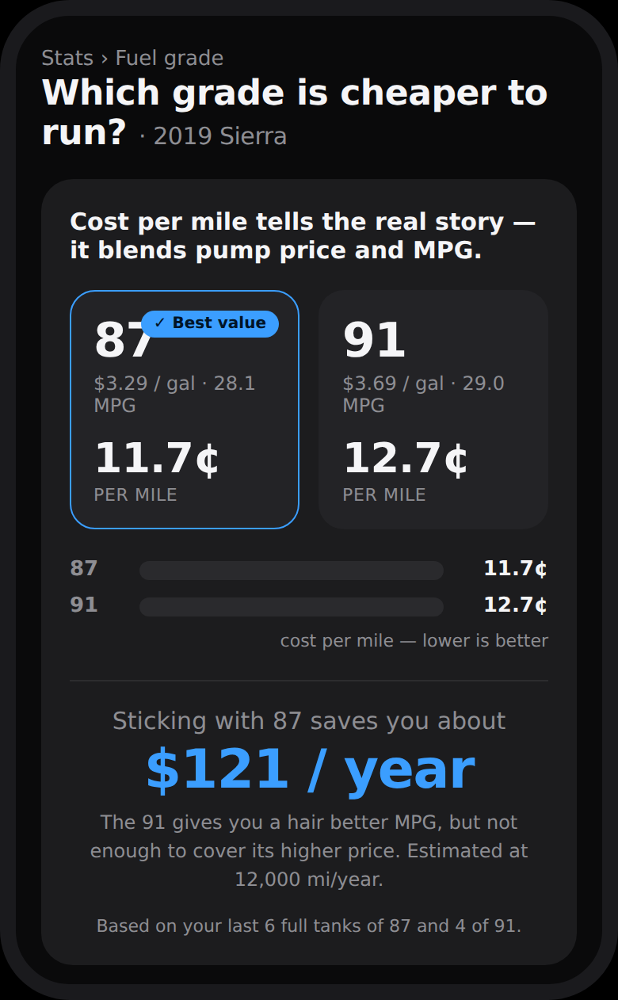
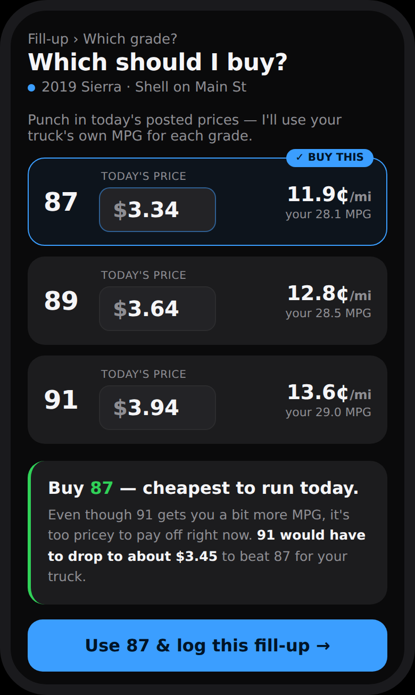

<div align="center">

# ⛽ Pitstop

**A self-hosted fuel & maintenance tracker you actually own.**

[](LICENSE)
[](#status)
[](CONTRIBUTING.md)

</div>

---

Pitstop lets you log fuel-ups, watch your fuel economy, and stay on top of vehicle
maintenance — all running on **your** hardware and open to anyone who wants to
self-host it. It supports multiple users,
each with a private garage of vehicles, handles everything from gas trucks to pure
EVs, and installs to your phone's home screen so logging a fill-up at the pump takes
seconds.

It ships as a **single Docker container** designed to sit behind a Cloudflare tunnel,
and runs just as happily on a bare VM, LXC, or metal.

> **Status:** feature-complete beta — all six build phases are implemented and
> tested. See [`docs/DESIGN.md`](docs/DESIGN.md) for the full design document.

## Screens

<table>
  <tr>
    <td align="center" width="33%">
      <br>
      <b>Garage</b><br><sub>Your vehicles at a glance</sub>
    </td>
    <td align="center" width="33%">
      <br>
      <b>Pump logging</b><br><sub>A fill-up in a couple of taps</sub>
    </td>
    <td align="center" width="33%">
      <br>
      <b>Service & reminders</b><br><sub>What's due, sorted by urgency</sub>
    </td>
  </tr>
  <tr>
    <td align="center" width="33%">
      <br>
      <b>Fuel-grade comparison</b><br><sub>Which octane has been cheaper</sub>
    </td>
    <td align="center" width="33%">
      <br>
      <b>Buy advisor</b><br><sub>Which grade to buy right now</sub>
    </td>
    <td align="center" width="33%"></td>
  </tr>
</table>

## Features

- **Fast pump logging** — a mobile-first quick-add flow with live price math: enter
  any two of gallons / price-per-gallon / total and the third fills itself in.
- **Real fuel economy** — per-fill and average MPG, cost per mile, monthly and
  lifetime spend, with correct handling of partial and missed fill-ups.
- **Is premium worth it?** — Pitstop tracks economy **per fuel grade** and compares
  them by **cost per mile**, so it tells you in real dollars whether cheaper-but-lower
  or pricier-but-higher fuel actually saves you money in *your* car.
- **Live "which grade to buy" advisor** — at the pump, punch in today's posted prices
  and Pitstop uses your car's measured MPG per grade to recommend the cheapest to run
  right now — including the break-even price premium would need to hit to win.
- **Maintenance & reminders** — service history plus reminders by mileage, time, or
  both, with upcoming / due / overdue status.
- **Every vehicle type** — gas, diesel, hybrid, plug-in hybrid, and pure EV (charge
  sessions in kWh). Each vehicle only shows the fields relevant to its type.
- **Fully editable** — mistyped an odometer or price? Tap any past entry to fix or
  delete it, and your stats recompute automatically. Nothing is write-once.
- **Multi-user** — each person gets their own private garage.
- **Own your data** — flexible CSV import with column mapping (plus presets for the
  formats other fuel trackers export) and full CSV/JSON export.
- **Installable PWA** — add it to your home screen; no app store, no native app.

## Tech stack

- **Backend:** Python + FastAPI (SQLModel/SQLAlchemy, Alembic)
- **Database:** SQLite by default, Postgres optional
- **Frontend:** React + Vite + TypeScript, built as an installable PWA
- **Packaging:** one Docker container (also runs on bare VM / LXC / metal)

## Status

All core functionality is built and tested: auth & multi-user, vehicles, the
quick-add fuel/charge flow with tested economy math, maintenance & reminders
with notifications, per-grade cost-per-mile comparison and the live buy
advisor, CSV import/export, charts, an installable offline-capable PWA, and an
admin panel. See [`docs/DESIGN.md`](docs/DESIGN.md) for the design document,
and [`ROADMAP.md`](ROADMAP.md) for known issues and what's next.

## Running locally

The whole app — API and web UI — is one container on one port.

```bash
git clone https://github.com/nightgarage/pitstop.git
cd pitstop
docker compose up -d
```

Open <http://localhost:8080>, and the first-run screen walks you through creating
the admin account. Data (SQLite database + generated secret) lives in the
`pitstop_data` volume. Configuration is entirely environment variables — see
[`.env.example`](.env.example) for every option (registration toggle, Postgres via
`DATABASE_URL`, subpath, and so on). The interactive API docs are served at
`/api/docs`.

### Development setup

Backend (Python 3.12+) and frontend run separately during development:

```bash
# API on :8000
cd backend
python -m venv .venv && . .venv/bin/activate   # Windows: .venv\Scripts\activate
pip install -e ".[dev]"
alembic upgrade head
uvicorn pitstop.main:app --reload

# Web UI on :5173 (proxies /api to :8000)
cd frontend
npm install
npm run dev
```

Run the backend tests with `pytest` from `backend/`.

## Self-hosting

See [`docs/DEPLOY.md`](docs/DEPLOY.md) for the full deployment guide: Docker
behind a Cloudflare tunnel (or any reverse proxy, with subpath support), the
non-Docker `pip install` + systemd path, health checks, and backups. A demo
instance with sample data is one env var away (`SEED_DEMO=true`).

## Contributing

Contributions are welcome — see [`CONTRIBUTING.md`](CONTRIBUTING.md). The best
place to start is an item from [`ROADMAP.md`](ROADMAP.md); open an issue to
claim it. Please keep changes aligned with the design doc.

## License

[MIT](LICENSE) © 2026 Pitstop contributors
